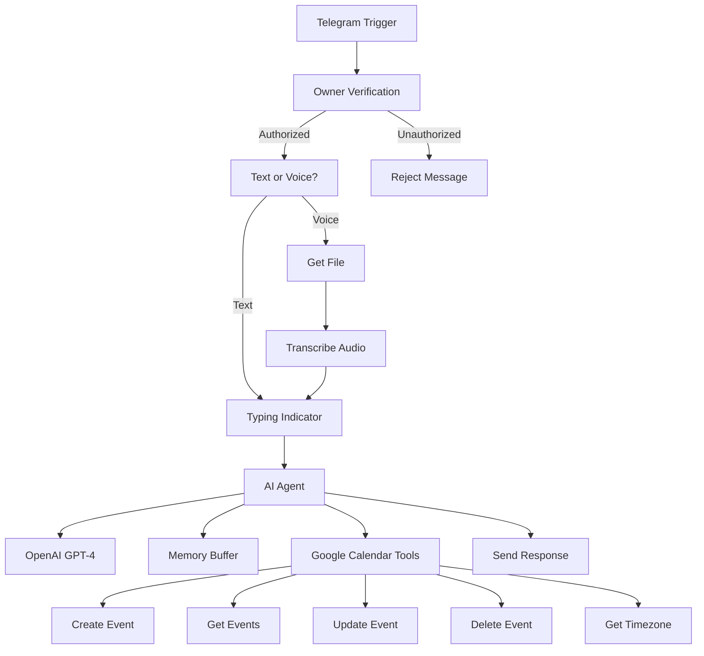

# 🤖 AI Calendar Assistant for Telegram

[](https://n8n.io)
[](https://opensource.org/licenses/MIT)
[](https://telegram.org/)

[🇬🇧 English](#-english-version) | [🇷🇺 Русский](#-русская-версия)

---

## 🇬🇧 English Version

Smart AI assistant for managing Google Calendar via Telegram with voice message support and natural language processing powered by **n8n** and **OpenAI GPT-4**.

### 📋 Description

A fully-featured n8n workflow that transforms a Telegram bot into an intelligent assistant for managing your Google Calendar. The bot understands natural language commands, recognizes voice messages, and can perform all basic calendar event operations.

### ✨ Features

- 📅 **Create Events** - "Create a meeting tomorrow at 3 PM"
- 🔍 **Search Events** - "What do I have this week?"
- ✏️ **Edit Events** - "Move meeting with John to 4 PM"
- 🗑️ **Delete Events** - "Delete Monday's meeting"
- 🎤 **Voice Input** - Send voice messages instead of text
- 🧠 **Context Memory** - Bot remembers last 10 messages
- 🌍 **Smart Time Detection** - Automatically detects timezone
- 🔒 **Access Control** - Owner-only access

### 🛠️ Tech Stack

- **n8n** - Workflow automation platform
- **OpenAI GPT-4.1-mini** - Natural language processing
- **OpenAI Whisper** - Voice recognition
- **Google Calendar API** - Event management
- **Telegram Bot API** - User interface

### 📦 Project Structure

```
google-calendar-ai-tg-assistant/
├── 💀 - Google Calendar + TG + AI assistant v2.json  # n8n workflow
├── README.md                                          # Documentation (EN + RU)
├── SETUP.md                                           # Setup instructions
├── QUICKSTART.md                                      # Quick start guide
├── CONTRIBUTING.md                                    # Contribution guide
├── LICENSE                                            # MIT License
├── .gitignore                                         # Ignored files
└── docs/                                              # Additional documentation
    ├── architecture.md                                # Workflow architecture
    ├── examples.md                                    # Usage examples
    ├── troubleshooting.md                             # Troubleshooting guide
    ├── roadmap.md                                     # Development roadmap
    └── screenshots/                                   # Interface screenshots
```

### 🚀 Quick Start

#### Requirements

- [n8n](https://n8n.io/) (self-hosted or cloud)
- [Telegram Bot Token](https://core.telegram.org/bots#creating-a-new-bot)
- [OpenAI API Key](https://platform.openai.com/api-keys)
- [Google Calendar OAuth2 credentials](https://developers.google.com/calendar/api/quickstart)

#### Installation

1. **Clone the repository:**
   ```bash
   git clone https://github.com/yourusername/google-calendar-ai-tg-assistant.git
   cd google-calendar-ai-tg-assistant
   ```

2. **Import workflow into n8n:**
   - Open n8n
   - Click "Import from File"
   - Select `💀 - Google Calendar + TG + AI assistant v2.json`

3. **Configure credentials:**
   - Telegram Bot API
   - OpenAI API
   - Google Calendar OAuth2

4. **Set your Owner ID:**
   - Get your Telegram ID (e.g., via @userinfobot)
   - Replace `331119294` with your ID in nodes:
     - "Owner Verification"
     - "Simple Memory" (sessionKey)
     - "Error Notification" (chatId)

5. **Activate workflow:**
   - Click "Active" in the top right corner

Detailed instructions: [SETUP.md](SETUP.md)

### 💬 Usage Examples

**Text Commands:**
```
👤 User: Create a meeting with Anna tomorrow at 2 PM
🤖 Bot: ✅ Created event "Meeting with Anna" for tomorrow at 2 PM

👤 User: What do I have next week?
🤖 Bot: 🔍 Found 3 events for next week:
       1. Team Meeting - Monday, 3:00 PM
       2. Client Call - Wednesday, 10:30 AM
       3. Birthday - Friday, All day
```

**Voice Messages:**
```
🎤 "Move the meeting with Andrew to three PM"
🤖 ✅ Updated event "Meeting with Andrew" to 3:00 PM
```

### 🏗️ Workflow Architecture



### 🔧 Workflow Components

| Node | Purpose |
|------|---------|
| **Telegram Trigger** | Receives incoming messages |
| **Owner Verification** | Checks user ID |
| **Text or Voice?** | Determines message type |
| **Get a file** | Downloads voice message |
| **Transcribe a recording** | Converts speech to text (Whisper) |
| **Typing Indicator** | Shows "typing..." status |
| **Calendar AI Agent** | Processes requests via GPT-4 |
| **OpenAI Chat Model** | GPT-4.1-mini language model |
| **Simple Memory** | Stores dialog context (10 messages) |
| **Create an event** | Creates calendar events |
| **Get many events** | Retrieves event list |
| **Update an event** | Updates existing events |
| **Delete an event** | Deletes events |
| **HTTP Request** | Gets user timezone |
| **Send a text message** | Sends response to Telegram |
| **Error Trigger** | Catches errors |
| **Error Notification** | Sends error notifications |

### 🔒 Security

- ✅ Owner-only access (Telegram ID verification)
- ✅ Unauthorized users receive rejection message
- ✅ Sensitive data (tokens, keys) stored in n8n credentials
- ✅ `.gitignore` excludes confidential information from repository

### 📊 System Requirements

- **n8n**: version 1.0+
- **Node.js**: 18.x or higher (for self-hosted)
- **RAM**: minimum 512 MB
- **Disk**: ~100 MB for workflow

### 🐛 Known Limitations

- Maximum 10 messages in memory context
- Voice messages: up to 20 MB
- Recognition only in Russian and English
- API rate limits (OpenAI, Telegram, Google Calendar)

### 🤝 Contributing

Contributions are welcome! Please:

1. Fork the project
2. Create a feature branch (`git checkout -b feature/AmazingFeature`)
3. Commit your changes (`git commit -m 'Add AmazingFeature'`)
4. Push to the branch (`git push origin feature/AmazingFeature`)
5. Open a Pull Request

### 📝 Changelog

**v2.0.0** (2025-01-01)
- Added voice message support
- Improved natural language processing
- Added context memory (10 messages)
- Automatic timezone detection
- Enhanced error handling

### 📄 License

MIT License - see [LICENSE](LICENSE)

### 👨‍💻 Author

Created with ❤️ for calendar automation

### 🙏 Acknowledgments

- [n8n.io](https://n8n.io/) - for the amazing automation platform
- [OpenAI](https://openai.com/) - for GPT-4 and Whisper
- [Telegram](https://telegram.org/) - for Bot API

### 📞 Support

If you have questions or need help:
- 📧 Open an issue on GitHub
- 💬 Contact: [@khanalytiq](https://t.me/khanalytiq)

**⭐ If you find this project useful, please give it a star!**

---

## 🇷🇺 Русская версия

Умный AI-ассистент для управления Google Calendar через Telegram с поддержкой голосовых сообщений и обработки естественного языка на базе **n8n** и **OpenAI GPT-4**.

### 📋 Описание

Это полнофункциональный workflow для n8n, который превращает Telegram-бота в интеллектуального помощника для управления вашим календарём Google Calendar. Бот понимает команды на естественном языке, распознаёт голосовые сообщения и может выполнять все основные операции с событиями календаря.

### ✨ Возможности

- 📅 **Создание событий** - "Создай встречу завтра в 15:00"
- 🔍 **Поиск событий** - "Что у меня на этой неделе?"
- ✏️ **Редактирование** - "Перенеси встречу с Иваном на 16:00"
- 🗑️ **Удаление** - "Удали встречу в понедельник"
- 🎤 **Голосовой ввод** - Отправляйте голосовые сообщения вместо текста
- 🧠 **Контекстная память** - Бот помнит предыдущие 10 сообщений
- 🌍 **Умное определение времени** - Автоматически определяет часовой пояс
- 🔒 **Защита от посторонних** - Доступ только для владельца

### 🛠️ Технологический стек

- **n8n** - платформа автоматизации workflow
- **OpenAI GPT-4.1-mini** - обработка естественного языка
- **OpenAI Whisper** - распознавание голоса
- **Google Calendar API** - управление событиями
- **Telegram Bot API** - интерфейс взаимодействия

### 📦 Структура проекта

```
google-calendar-ai-tg-assistant/
├── 💀 - Google Calendar + TG + AI assistant v2.json  # n8n workflow
├── README.md                                          # Документация (EN + RU)
├── SETUP.md                                           # Инструкция по настройке
├── QUICKSTART.md                                      # Быстрый старт
├── CONTRIBUTING.md                                    # Руководство для контрибьюторов
├── LICENSE                                            # Лицензия MIT
├── .gitignore                                         # Игнорируемые файлы
└── docs/                                              # Дополнительная документация
    ├── architecture.md                                # Архитектура workflow
    ├── examples.md                                    # Примеры использования
    ├── troubleshooting.md                             # Решение проблем
    ├── roadmap.md                                     # Дорожная карта
    └── screenshots/                                   # Скриншоты интерфейса
```

### 🚀 Быстрый старт

#### Требования

- [n8n](https://n8n.io/) (self-hosted или cloud)
- [Telegram Bot Token](https://core.telegram.org/bots#creating-a-new-bot)
- [OpenAI API Key](https://platform.openai.com/api-keys)
- [Google Calendar OAuth2 credentials](https://developers.google.com/calendar/api/quickstart)

#### Установка

1. **Клонируйте репозиторий:**
   ```bash
   git clone https://github.com/yourusername/google-calendar-ai-tg-assistant.git
   cd google-calendar-ai-tg-assistant
   ```

2. **Импортируйте workflow в n8n:**
   - Откройте n8n
   - Нажмите "Import from File"
   - Выберите файл `💀 - Google Calendar + TG + AI assistant v2.json`

3. **Настройте credentials:**
   - Telegram Bot API
   - OpenAI API
   - Google Calendar OAuth2

4. **Настройте Owner ID:**
   - Узнайте свой Telegram ID (например, через @userinfobot)
   - Замените `331119294` на ваш ID в узлах:
     - "Owner Verification"
     - "Simple Memory" (sessionKey)
     - "Error Notification" (chatId)

5. **Активируйте workflow:**
   - Нажмите "Active" в правом верхнем углу

Подробная инструкция: [SETUP.md](SETUP.md)

### 💬 Примеры использования

**Текстовые команды:**
```
👤 Пользователь: Создай встречу с Анной завтра в 14:00
🤖 Бот: ✅ Создал событие "Встреча с Анной" на завтра в 14:00

👤 Пользователь: Что у меня на следующей неделе?
🤖 Бот: 🔍 Нашёл 3 события на следующей неделе:
       1. Совещание - Понедельник, 15:00
       2. Звонок клиенту - Среда, 10:30
       3. День рождения - Пятница, весь день
```

**Голосовые сообщения:**
```
🎤 "Перенеси встречу с Андреем на три часа вечера"
🤖 ✅ Обновил событие "Встреча с Андреем" на 15:00
```

### 🏗️ Архитектура workflow


### 🔧 Компоненты workflow

| Узел | Назначение |
|------|-----------|
| **Telegram Trigger** | Получает входящие сообщения |
| **Owner Verification** | Проверяет ID пользователя |
| **Text or Voice?** | Определяет тип сообщения |
| **Get a file** | Загружает голосовое сообщение |
| **Transcribe a recording** | Преобразует речь в текст (Whisper) |
| **Typing Indicator** | Показывает статус "печатает..." |
| **Calendar AI Agent** | Обрабатывает запросы через GPT-4 |
| **OpenAI Chat Model** | Языковая модель GPT-4.1-mini |
| **Simple Memory** | Хранит контекст диалога (10 сообщений) |
| **Create an event** | Создаёт события в календаре |
| **Get many events** | Получает список событий |
| **Update an event** | Обновляет существующие события |
| **Delete an event** | Удаляет события |
| **HTTP Request** | Получает часовой пояс пользователя |
| **Send a text message** | Отправляет ответ в Telegram |
| **Error Trigger** | Перехватывает ошибки |
| **Error Notification** | Отправляет уведомления об ошибках |

### 🔒 Безопасность

- ✅ Доступ только для владельца (проверка Telegram ID)
- ✅ Неавторизованные пользователи получают сообщение об отказе
- ✅ Чувствительные данные (токены, ключи) хранятся в credentials n8n
- ✅ `.gitignore` исключает конфиденциальную информацию из репозитория

### 📊 Системные требования

- **n8n**: версия 1.0+
- **Node.js**: 18.x или выше (для self-hosted)
- **RAM**: минимум 512 МБ
- **Диск**: ~100 МБ для workflow

### 🐛 Известные ограничения

- Максимум 10 сообщений в контексте памяти
- Голосовые сообщения: до 20 МБ
- Распознавание только на русском и английском языках
- Rate limits API (OpenAI, Telegram, Google Calendar)

### 🤝 Участие в разработке

Вклад приветствуется! Пожалуйста:

1. Fork проекта
2. Создайте feature branch (`git checkout -b feature/AmazingFeature`)
3. Commit изменения (`git commit -m 'Add AmazingFeature'`)
4. Push в branch (`git push origin feature/AmazingFeature`)
5. Откройте Pull Request

### 📝 История изменений

**v2.0.0** (2025-01-01)
- Добавлена поддержка голосовых сообщений
- Улучшена обработка естественного языка
- Добавлен контекст памяти (10 сообщений)
- Автоматическое определение часового пояса
- Улучшена обработка ошибок

### 📄 Лицензия

MIT License - см. [LICENSE](LICENSE)

### 👨‍💻 Автор

Создано с ❤️ для автоматизации работы с календарём

### 🙏 Благодарности

- [n8n.io](https://n8n.io/) - за потрясающую платформу автоматизации
- [OpenAI](https://openai.com/) - за GPT-4 и Whisper
- [Telegram](https://telegram.org/) - за Bot API

### 📞 Поддержка

Если у вас есть вопросы или нужна помощь:
- 📧 Откройте issue на GitHub
- 💬 Контакт: [@khanalytiq](https://t.me/khanalytiq)

**⭐ Если проект оказался полезным, поставьте звезду!**
